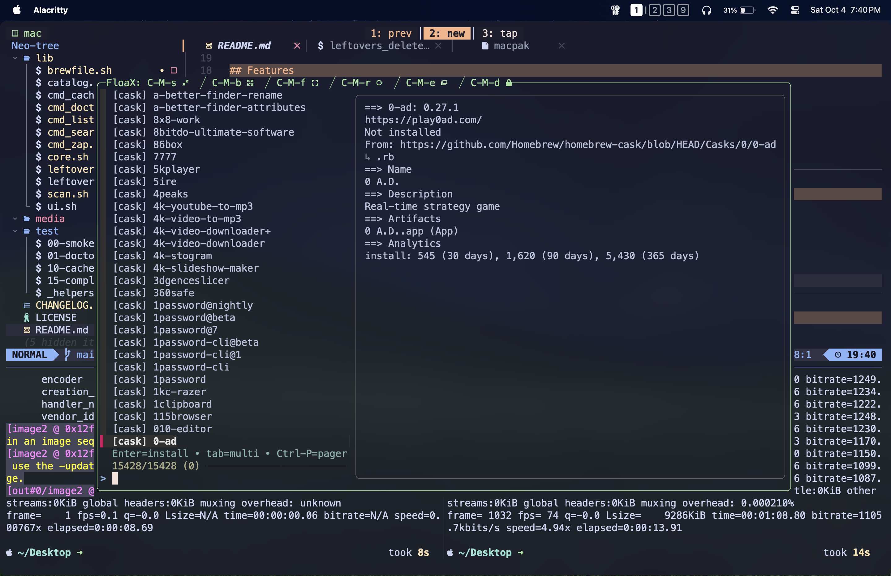

# macpak



**macpak** — Interactive wrapper that makes Homebrew much easier to use + zapper for non-brew apps (fzf-powered).  
It provides a fast, streamlined way to browse, install, and uninstall packages with additional cleanup helpers for non-brew software.  

Most macOS users rely on **Homebrew** as their primary package manager.  
While installing or uninstalling is just a single command, in practice these tasks often turn into multi-step workflows — searching for the right package, checking its details with `brew info`, or listing installed packages before deciding what to remove.  

Uninstalls also leave behind leftovers since Homebrew doesn’t always remove everything.  
And for apps installed outside of Homebrew, dragging them to the Trash doesn’t clean up their hidden files either.  

**macpak** solves these problems by streamlining searches, installs, and uninstalls into an interactive workflow, while also handling non-brew apps with a zapper that removes both the application package and its leftovers in one go.  

For full guidance and configuration details, please check the [documentation](https://kavindujayarathne.com/blogs/macpak-documentation).

## Features

- 🔍 Fuzzy search Homebrew formulas & casks  
- 📦 Interactive install/uninstall flow  
- 🧹 Zapper for non-brew apps (app + leftovers)  
- ⚡ Cached index for speed  
- 🛠 Doctor command for sanity checks  

## Installation

Install directly from the tap:

```bash
brew tap kavindujayarathne/macpak
brew install --formula macpak
```

## Usage

```bash
macpak search [query]       # browse Homebrew catalog with preview; Enter to install
macpak list [query]         # browse installed packages; Enter to uninstall
macpak zap <keyword>        # sweep and remove non-brew apps with leftovers
macpak cache refresh        # rebuild the cached Homebrew index
macpak doctor               # check required/optional tools and config
```

> [!NOTE]
> For environment variables and advanced configuration via `~/.config/macpak/config.sh`,  
> see the [documentation](https://kavindujayarathne.com/blogs/macpak-documentation).

## License

This project is licensed under the [MIT License](LICENSE).

## Contributing

Contributions, issues, and feature requests are welcome!  
Please also feel free to open an issue if you run into bugs or have feature suggestions.
