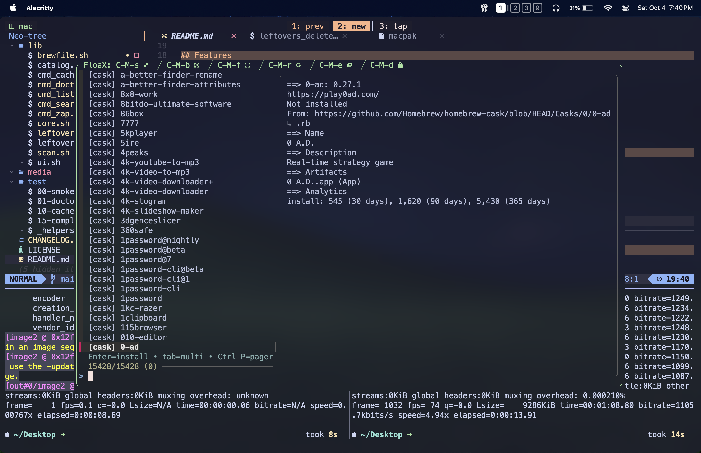

# macpak



macpak is an interactive wrapper around Homebrew for macOS. It lets you browse, install, and
uninstall Homebrew packages through a fuzzy-finder interface with live previews, so you spend less
time typing commands and more time getting things done. It also includes a zapper that can
completely remove applications installed outside of Homebrew, along with their leftovers.

Read more:

- [Documentation](https://kavindujayarathne.com/blogs/macpak-documentation)
- [Story behind macpak](https://kavindujayarathne.com/blogs/journey-of-my-first-cli-tool)

## Demo

<!-- Demo source: https://github.com/kavindujayarathne/macpak/tree/main/media/demo-video.mp4 -->
https://github.com/user-attachments/assets/c8d93549-d97b-4853-b969-ad998ffaa93e

## Features

- Fuzzy search Homebrew formulas & casks  
- Interactive install/uninstall flow  
- Zapper for non-brew apps (app + leftovers)  
- Cached index for speed  
- Doctor command for sanity checks  

## Requirements

- [Homebrew](https://brew.sh/) (must be installed on the system)
- [fzf](https://github.com/junegunn/fzf) (installed automatically if missing)

## Installation

Install via [Homebrew](https://brew.sh/) to get autoupdates (Preferred):

```bash
brew install --formula kavindujayarathne/macpak/macpak
```

## Usage

```bash
macpak search [query]          Search available Homebrew formulae and casks; Enter to install
macpak list [query]            List installed Homebrew formulae and casks; Enter to uninstall
macpak zap <keyword>           Sweep and remove non-brew apps with leftovers
macpak cache-refresh           Refresh the cached Homebrew index
macpak doctor                  Check required/optional tools and config
```

> [!NOTE]
> For environment variables and advanced configuration via `~/.config/macpak/config.sh`,  
> see the [documentation](https://kavindujayarathne.com/blogs/macpak-documentation).

## License

This project is licensed under the [MIT License](LICENSE).

## Contributing

Contributions, issues, and feature requests are welcome!  
Please also feel free to open an issue if you run into bugs or have feature suggestions.
